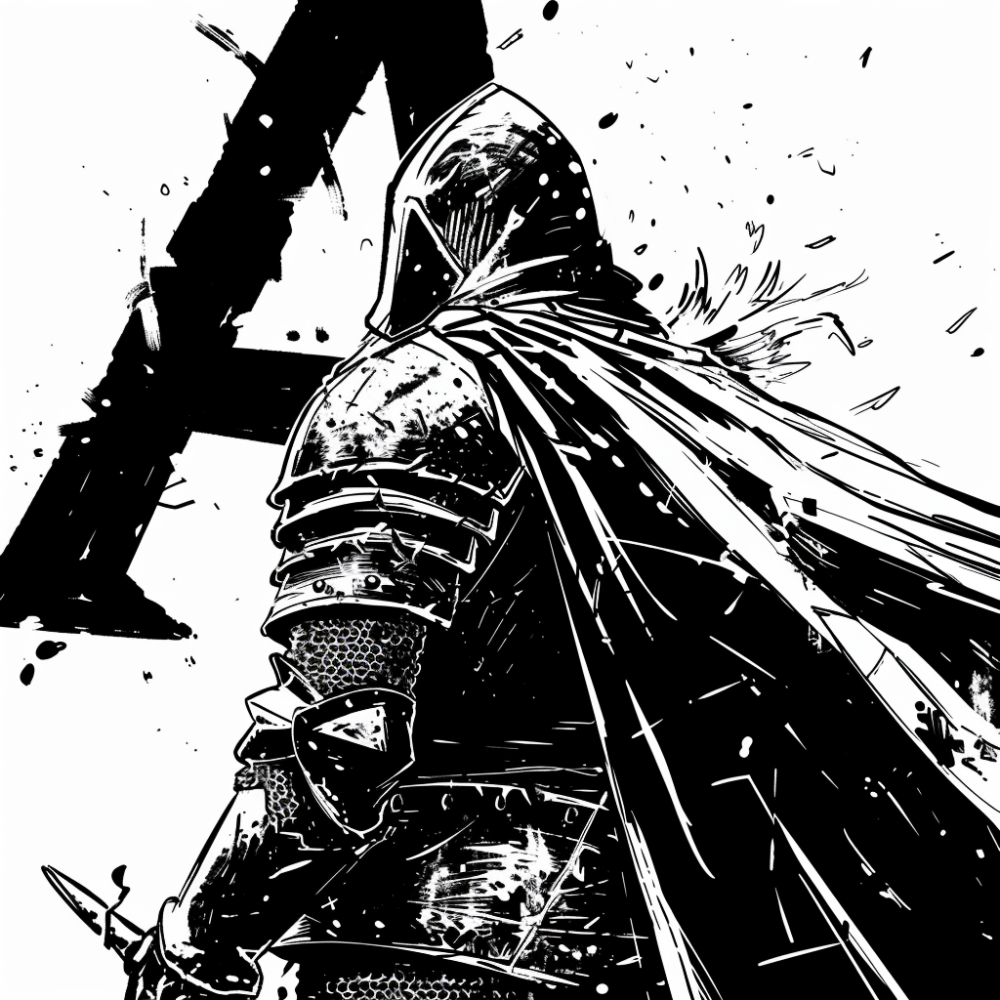

# Hi there, I'm Roman 👋

I'm a passionate Web developer with a master's in engineering. I have been working in this field since 2017 and since that time, I have had the privilege to work at prominent international companies, managing large codebases and heavily loaded products.

## 🛠 Skills

### Frontend:
- **Frameworks/Libraries:** Angular, React, ngrx, redux, rxjs, Firebase MUI, Angular Material, Kendo UI

  

- **Languages:** TypeScript, EcmaScript

  

### Backend:
- **Technologies/Languages:** NodeJS, Flask, Python, PHP

  

- **Databases:** MongoDB, MySQL, PostgreSQL, SQLite

  

## 🚀 Latest projects

Algoria is an adventure game where players solve puzzles and complete challenges using various data structures and
algorithms. This is an open-source project. Feel free to watch the repo, to not miss the time when it become ready to receive the first PRs. I'm
currently working on making it more developer-friendly, more on that [here](https://github.com/chm-org/algoria-app?tab=readme-ov-file#is-it-opened-for-contribution-right-now). Who knows,
maybe your next coding challenge will turn into a PR! 😉

    

Repo: https://github.com/chm-org/algoria-app

## 🚀 Learning and Growth

- Completed the IBM [AI Developer Specialization](https://www.coursera.org/account/accomplishments/specialization/9FVADF3E3G6H)
- Highly interested in AI and Data Science domains
- Currently working on a project that uses generative AI under the hood

---

Feel free to reach out to me through my [LinkedIn](https://www.linkedin.com/in/roman-kordas-1933b7a4/). You can also check out my portfolio at [My Portfolio](https://www.upwork.com/freelancers/~012efc0164c4c804ba).

Thanks for visiting my profile!
